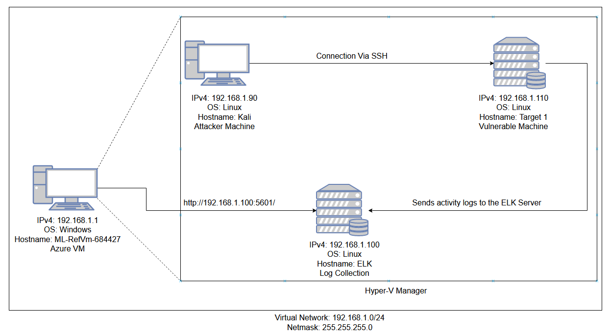
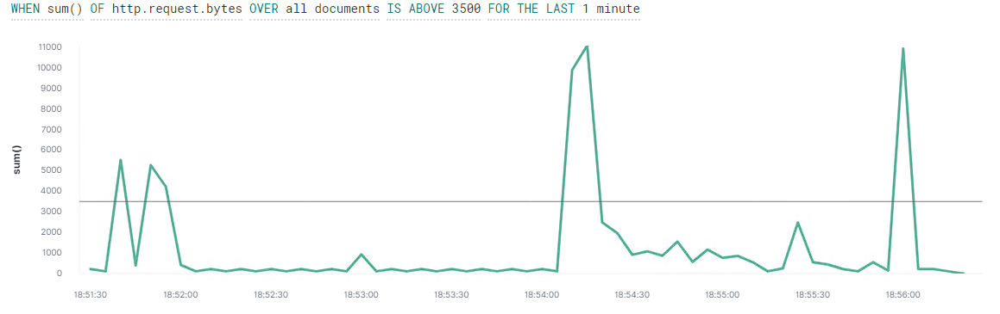
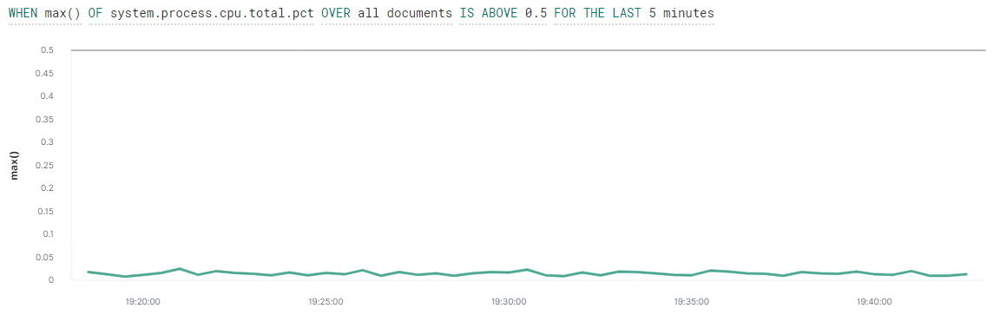
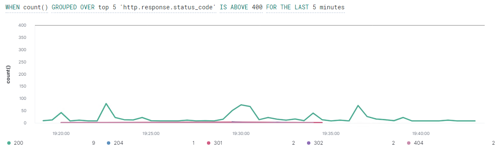

# Blue Team: Summary of Operations

## Table of Contents
- Network Topology
- Description of Targets
- Monitoring the Targets
- Patterns of Traffic & Behavior
- Suggestions for Going Further

### Network Topology

The following machines were identified on the network:
- ML-RefVm-684427
  - **Operating System**: Windows 
  - **Purpose**: Azure VM, Hyper-V Manager and used to view ELK logs
  - **IP Address**: 192.168.1.1
- Kali
  - **Operating System**: Linux
  - **Purpose**: Attacker Machine
  - **IP Address**: 192.168.1.90
- Target 1
  - **Operating System**: Linux
  - **Purpose**: Vulnerable Machine
  - **IP Address**: 192.168.1.110
- ELK
  - **Operating System**: Linux
  - **Purpose**: Log Collection
  - **IP Address**: 192.168.1.100

### Description of Targets

The target of this attack was: `Target 1` (192.168.1.110).

Target 1 is an Apache web server and has SSH enabled, so ports 80 and 22 are possible ports of entry for attackers. As such, the following alerts have been implemented:

### Monitoring the Targets

Traffic to these services should be carefully monitored. To this end, we have implemented the alerts below:

##### HTTP Request Size Monitor
`HTTP Request Size Monitor` is implemented as follows:
  - **Metric**: sum() of http.request.bytes OVER all documents
  - **Threshold**: ABOVE 3500 FOR THE LAST 1 minute
  - **Vulnerability Mitigated**: Enumeration from things such as nmap scans or wpscan.
  - **Reliability**: This alert has medium reliability as it will detect enumeration such as nmap scans and wpscan however this alert seems to generate a high amount of false positives.

  

##### CPU Usage Monitor
`CPU Usage Monitor` is implemented as follows:
  - **Metric**: max() OF system.process.cpu.total.pct OVER all documents
  - **Threshold**: ABOVE 0.5 FOR THE LAST 5 minutes
  - **Vulnerability Mitigated**: Hash cracking tools such as John the Ripper used within the `Target 1` machine.
  - **Reliability**: This alert has low reliability as although it does not generate many false positives/false negatives, an attacker would never us hash cracking within the `Targeet 1` machine. Instead they would exfiltrate the password hashes and use hash cracking tools, such as John the Ripper, to crack the hashes on their own machine which would completely bypass this alert.

  

##### Excessive HTTP Errors
`Excessive HTTP Errors` is implemented as follows:
  - **Metric**: count() GROUPED OVER top 5 'http.response.status.code'
  - **Threshold**: ABOVE 400 FOR THE LAST 5 minutes
  - **Vulnerability Mitigated**: Brute force attacks against the web server over http.
  - **Reliability**: This alert has high reliability as it does not generate many false positives/flase negatives and would detect brute force attacks against the web server over http. However it should be said that this alert would not detect brute force attacks via something like ssh but this is out of scope of what this particular alert is designed to accomplish and as such this alert it's high reliability status.

  

<!---
### Suggestions for Going Further (Optional)
_TODO_: 
- Each alert above pertains to a specific vulnerability/exploit. Recall that alerts only detect malicious behavior, but do not stop it. For each vulnerability/exploit identified by the alerts above, suggest a patch. E.g., implementing a blocklist is an effective tactic against brute-force attacks. It is not necessary to explain _how_ to implement each patch.

The logs and alerts generated during the assessment suggest that this network is susceptible to several active threats, identified by the alerts above. In addition to watching for occurrences of such threats, the network should be hardened against them. The Blue Team suggests that IT implement the fixes below to protect the network:
- Vulnerability 1
  - **Patch**: TODO: E.g., _install `special-security-package` with `apt-get`_
  - **Why It Works**: TODO: E.g., _`special-security-package` scans the system for viruses every day_
- Vulnerability 2
  - **Patch**: TODO: E.g., _install `special-security-package` with `apt-get`_
  - **Why It Works**: TODO: E.g., _`special-security-package` scans the system for viruses every day_
- Vulnerability 3
  - **Patch**: TODO: E.g., _install `special-security-package` with `apt-get`_
  - **Why It Works**: TODO: E.g., _`special-security-package` scans the system for viruses every day_
--->