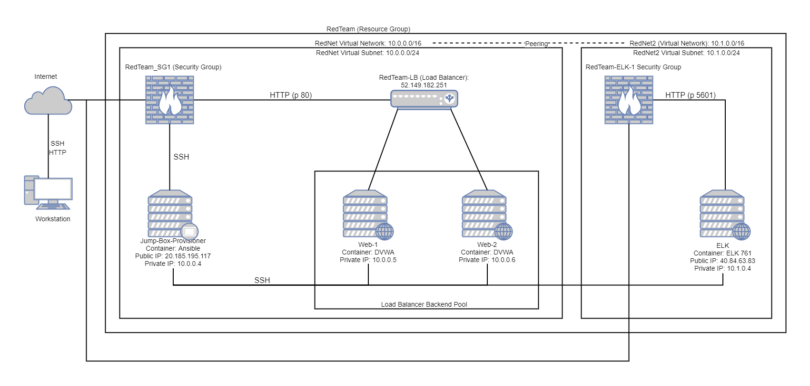
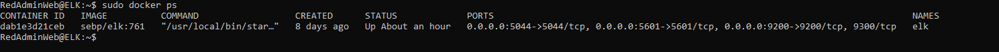

## Automated ELK Stack Deployment

The files in this repository were used to configure the network depicted below.



These files have been tested and used to generate a live ELK deployment on Azure. They can be used to either recreate the entire deployment pictured above. Alternatively, select portions of the YAML files may be used to install only certain pieces of it, such as Filebeat.

  - [DVWA-playbook](Ansible/Roles/DVWA-playbook.yml)
  - [ELK-playbook](Ansible/Roles/ELK-playbook.yml)
  - [Filebeat-playbook](Ansible/Roles/Filebeat-playbook.yml)
  - [Metricbeat-playbook](Ansible/Roles/Metricbeat-playbook.yml)
  - [filebeat-config](Ansible/Files/filebeat-config.yml)
  - [metricbeat-config](Ansible/Files/metricbeat-config.yml)

This document contains the following details:
- Description of the Topology
- Access Policies
- ELK Configuration
  - Beats in Use
  - Machines Being Monitored
- How to Use the Ansible Build


### Description of the Topology

The main purpose of this network is to expose a load-balanced and monitored instance of DVWA, the D*mn Vulnerable Web Application.

Load balancing ensures that the application will be highly available, in addition to restricting access to the network.
- What aspect of security do load balancers protect? What is the advantage of a jump box?\
The aspect of security a load balancer protects is availability. The advantage of a jump box is access control.

Integrating an ELK server allows users to easily monitor the vulnerable VMs for changes to the log files and system metrics.
- What does Filebeat watch for?\
Filebeat watches out for changes in log files.  
- What does Metricbeat record?\
System metrics such as CPU usage and memory usage.

The configuration details of each machine may be found below.

| Name                 | Function   | IP Address | Operating System |
|----------------------|------------|------------|------------------|
| Jump-Box-Provisioner | Gateway    | 10.0.0.4   | Linux (Ubuntu)   |
| Web-1                | Web Server | 10.0.0.5   | Linux (Ubuntu)   |
| Web-2                | Web Server | 10.0.0.6   | Linux (Ubuntu)   |
| ELK                  | ELK Stack  | 10.1.0.4   | Linux (Ubuntu)   |

### Access Policies

The machines on the internal network are not exposed to the public Internet. 

Only the Jump-Box-Provisioner and ELK machine can accept connections from the Internet. Access to these machines is only allowed from the following IP addresses:
- The Jump-Box-Provisioner machine can be accessed from my home IP address via ssh.
- The ELK machine can be accessed from my home IP address via port 5601 and from 10.0.0.4 via ssh.

Machines within the network can only be accessed by Jump-Box-Provisioner.
- Which machine did you allow to access your ELK VM? What was its IP address?\
Jump-Box-Provisioner, it's IP address was 10.0.0.4

A summary of the access policies in place can be found in the table below.

| Name                 | Publicly Accessible | Allowed IP Addresses    |
|----------------------|---------------------|-------------------------|
| Jump-Box-Provisioner | Yes                 | My Home IP              |
| Web-1                | No                  | 10.0.0.4                |
| Web-2                | No                  | 10.0.0.4                |
| ELK                  | Yes                 | My Home IP and 10.0.0.4 |
| Load Balancer        | Yes                 | My Home IP              |

### Elk Configuration

Ansible was used to automate configuration of the ELK machine. No configuration was performed manually, which is advantageous because...
- This allowed me to configure the ELK machine quickly and easily. All I have to do was create a playbook with what I want configured and Ansible does all the heavy lifting

The playbook implements the following tasks:
- Install docker.io
- Install python3-pip
- Increase virtual memory on ELK machine
- Install and launch docker elk container
- Enable docker service on boot

The following screenshot displays the result of running `docker ps` after successfully configuring the ELK instance.



### Target Machines & Beats
This ELK server is configured to monitor the following machines:
- Web-1 10.0.0.5
- Web-2 10.0.0.6

We have installed the following Beats on these machines:
- Filebeat
- Metricbeat

These Beats allow us to collect the following information from each machine:
- Filebeat collects system logs, such as sudo commands and SSH logins, from the Web VM's and forwards it to the ELK VM.
- Metricbeat collects system metrics, such as CPU usage and memory usage, from the Web VM's and forwards it to the ELK VM.

### Using the Playbook
In order to use the playbook, you will need to have an Ansible control node already configured. Assuming you have such a control node provisioned: 

SSH into the control node and follow the steps below:
- Copy the [ELK-playbook.yml](Ansible/Roles/ELK-playbook.yml) file to /etc/ansible/roles.
- Update the hosts file to include...\

- Run the playbook, and navigate to _[ELK VM IP address]_:5601/app/kibana to check that the installation worked as expected.

Here are the specific commands the user will need to run to download the playbook, update the files, etc.

- To download the playbook run the following command in the /etc/ansible/roles directory
```
curl -o ELK-playbook.yml https://github.com/jbchen2/Rice-Cybersecurity/blob/main/ansible/roles/ELK-playbook.yml
```
- To update the hosts file do a `nano hosts` in the /etc/ansible directory then edit the hosts file by inserting the following:
```
[elk]
10.1.0.4 ansible_python_interpreter=/usr/bin/python3
```
- To run the playbook use the following command
```
sudo ansible-playbook /etc/ansible/roles/ELK-playbook.yml
```